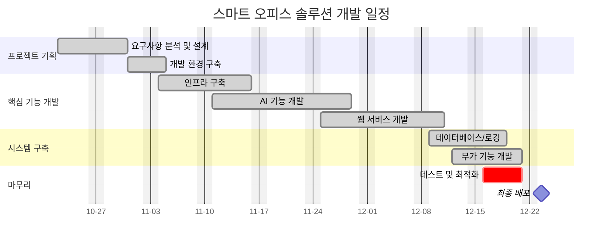

## Spring Boot & React & AI 서비스 기반 스마트 오피스 솔루션
AI 기술과 클라우드 기반의 통합 업무 환경을 구축하여 기업의 업무 효율성을 향상시키는 스마트 오피스 솔루션입니다.

### Team Members
- **프로젝트명**: 스마트 오피스 솔루션
- **개발 기간**: 2024.10.24 - 2024.12.23
- **개발 팀**:
    - PL&PM: 최태산
    - Frontend: 이은범
    - AI&Backend: 정연균
 


## 서비스 메인화면


## 시연 영상
https://www.youtube.com/watch?v=lOQpA_LLj4w


 
## 개발 일정
<details>
<summary>프로젝트 개발 일정</summary>



</details>

## Tech Stack


## 시스템 아키텍처


## 주요 기능
- **얼굴인식 출퇴근 관리**: DeepFace 기반 실시간 인증
- **화상회의**: WebRTC 기반 실시간 소통
- **OCR & 문서분석**: AI 기반 문서 자동화
- **업무 챗봇**: LLaMA 3.2 기반 선택형 응답
- **통계 & 모니터링**: ELK Stack 기반 데이터 분석


### 핵심 구성
- Docker 기반 컨테이너화
- Jenkins CI/CD 파이프라인
- Redis 캐싱 및 JWT 관리
- ELK Stack 로그 분석
- MSA 기반 확장 가능 구조

## 주요 기술 특징
1. **확장성**
- Docker 컨테이너화
- MSA 기반 설계
- Jenkins CI/CD

2. **AI 기술 통합**
- DeepFace 얼굴인식
- Upstage OCR
- LLaMA 3.2 챗봇

3. **실시간 처리**
- WebRTC P2P 연결
- Redis 캐싱
- WebSocket 실시간 통신

4. **보안 및 모니터링**
- JWT 기반 인증
- ELK Stack 로그 분석
- Redis 토큰 관리

## 실행 방법
```bash
# Clone repository
git clone [repository URL]

# Docker 컨테이너 실행
docker-compose up -d
```
