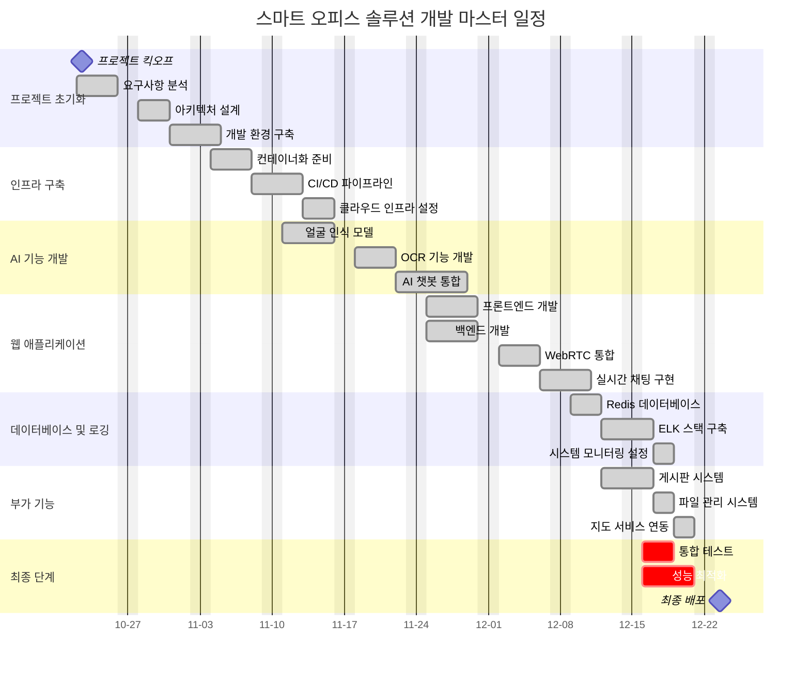

[](http://211.188.62.189:8080/job/SmartOffice)

# 🚀 Smart Office Solution

혁신적인 업무 환경의 미래를 위한 올인원 스마트 오피스 솔루션

## 📑 프로젝트 개요

### 기본 정보
- **프로젝트명**: 스마트 오피스 솔루션
- **개발 기간**: 2024.10.24 - 2024.12.24
- **개발 팀**:
    - PL&PM: 최태산
    - Frontend: 이은범
    - Backend: 정연균, 최태산


## 💡 프로젝트 소개

### 배경
현재 기업들이 직면한 주요 문제점:
- 분산된 업무 도구로 인한 생산성 저하
- 하이브리드 근무 환경에서의 협업 어려움
- 실시간 소통 채널의 비효율성
- 통합된 업무 플랫폼 부재

### ✨ 핵심 기능

1. **AI 기반 스마트 근태관리**
    - 유연근무제 지원
    - AI 얼굴인식 기반 출퇴근
    - 근무 현황 대시보드
    - 자동 리포트 생성

2. **스마트 캘린더 시스템**
    - 다차원 일정 관리
    - AI 기반 일정 최적화
    - 외부 캘린더 동기화

3. **통합 커뮤니케이션**
    - 통합 게시판
    - AI 강화 실시간 메신저
    - HD 화상회의
    - 자동 회의록 생성

4. **스마트 워크스페이스**
    - 클라우드 드라이브
    - 스마트 북마크
    - OCR 기반 문서 관리
    - AI 기반 업무 비서

## 🛠 기술 스택

### Frontend
- React
- JavaScript
- HTML/CSS
- Bootstrap
- TensorFlow.js (얼굴 인식)

### Backend
- SpringBoot
- Java
- WebSocket
- WebRTC
- LLaMA 3.1 (AI)
- OpenCV (얼굴 인식)
- Upstage (OCR)

### Database
- MySQL
- JPA

### Development Tools
- IntelliJ IDEA
- VS Code
- Git/Github
- PostMan
- Swagger
- Workbench

## 🔒 보안 요구사항

### 인증/인가
- [x] JWT 토큰 기반 인증
- [x] 역할 기반 접근 제어
- [x] SSO 구현
- [x] 얼굴 인식 데이터 보안

### 데이터 보안
- [x] AES-256 암호화
- [x] SSL/TLS 적용
- [x] API 보안 강화
- [x] 생체 정보 암호화 저장

## 📋 개발 일정



## 👥 Target Users

### 관리자 페르소나
- **김영호** (42세, IT팀 과장)
    - IT팀 7년차 베테랑
    - 시스템 운영/관리 전문가
    - 통합 관리 시스템 및 보안 강화 요구

### 일반 직원 페르소나
- **이미라** (29세, 기획팀 대리)
    - 기획팀 3년차
    - 하이브리드 근무자
    - 올인원 플랫폼 및 효율적 협업 도구 요구

## 🚀 Getting Started

### Prerequisites
```bash
node >= 16.0.0
java >= 17
mysql >= 8.0
```

### Installation
```bash
# Frontend
cd frontend
npm install
npm start

# Backend
cd backend
./gradlew build
java -jar build/libs/smart-office-0.0.1-SNAPSHOT.jar
```
